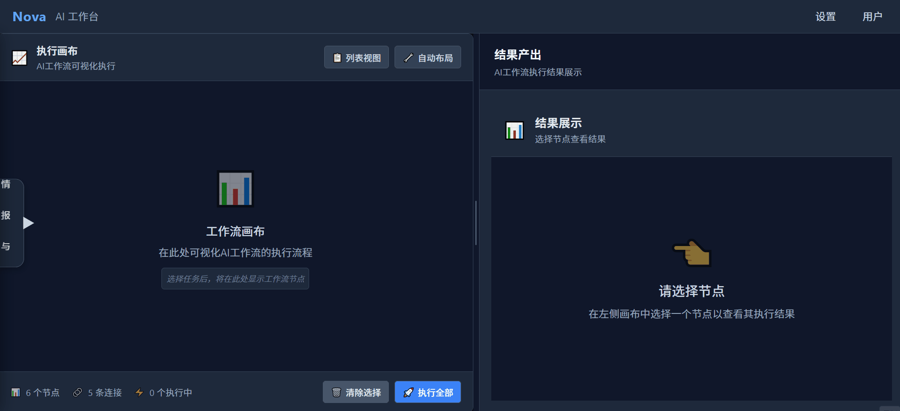

# Nova - AI 智能体运营系统

> 让多 Agent 协作像搭积木一样简单

https://img.shields.io/badge/Vue-3.5-brightgreen
https://img.shields.io/badge/FastAPI-0.104-blue
[https://img.shields.io/badge/TypeScript-%E4%B8%A5%E6%A0%BC%E6%A8%A1%E5%BC%8F-blue](https://img.shields.io/badge/TypeScript-严格模式-blue)
[https://img.shields.io/badge/Docker-%E4%B8%80%E9%94%AE%E9%83%A8%E7%BD%B2-2496ED](https://img.shields.io/badge/Docker-一键部署-2496ED)

## 项目简介

Nova 是一个 **AI 智能体运营系统**，采用**“硬件与应用”分层架构**，将 AI Agent 的**通用原子能力**与**业务场景**彻底解耦。

**ROI 核心数据**：对比传统手动分析流程，Nova 通过 SOP 自动化编排，将单次选品分析耗时从 **30 分钟降低至 2 分钟**，且确保 **100% 的路径可追溯**。

**当前 AI 能力**：已集成 LLM 调用接口（`foundation/communication/model_clients/`），支持 OpenAI / Ollama 双通道。电商选品分析的市场分析和简报生成节点已通过 LLM 增强。系统内建**反思层（Reflection）**，用于校验 LLM 输出质量，抑制幻觉。

## 为什么这样设计？

| 传统做法                  | Nova 的做法                                       | 带来的价值                             |
| :------------------------ | :------------------------------------------------ | :------------------------------------- |
| 业务逻辑散落在各 Agent 中 | 业务场景独立在 `business/`，不污染基础层          | 新增场景只需新建目录，**基础层零改动** |
| 图引擎与业务强耦合        | 确定性图引擎在 `foundation/cognition/` 中独立封装 | 相同 SOP 输入 → 相同路径 → 相同结果    |
| 前端直接调用 API 链       | VOE 事件驱动系统解耦 UI 与业务逻辑                | 前端只 dispatch 事件，组件间零耦合     |
| LLM 输出无校验            | 反思层（Reflection）校验输出质量                  | 降低 AI 幻觉风险，确保生产可用         |
| 数据库无理由堆砌          | 每个数据库有明确职责（关系/图/向量/缓存）         | 按需选型，不过度设计                   |

## 架构设计

text

```
┌─────────────────────────────────────────┐
│           business/                     │  ← 业务场景层（应用软件）
│     ecommerce/   conversation/           │
│     product_selection/ （电商选品分析）   │
└────────────────┬────────────────────────┘
                 │ 调用
┌────────────────▼────────────────────────┐
│           foundation/                   │  ← 基础能力层（硬件）
│   perception/   memory/   cognition/     │
│   action/       reflection/ ←反思校验    │
│   communication/（LLM 客户端）           │
└────────────────┬────────────────────────┘
                 │ 继承
┌────────────────▼────────────────────────┐
│             common/                     │  ← 公共契约层
│     core/      contracts/               │
└─────────────────────────────────────────┘
```


## 核心特点

- **确定性图引擎 + SOP 流程编排**：YAML 定义流程 → 图引擎驱动执行 → 相同输入保证相同路径
- **LLM 多模型支持**：集成 OpenAI/Ollama 双通道，支持 GPT-4/Claude/DeepSeek/Llama 热切换
- **闭环反思机制**：`foundation/reflection/` 层对 LLM 输出进行质量评分和合规检查，降低 AI 幻觉风险
- **事件驱动通信（VOE）**：EventBus 解耦 UI 与 Graph 引擎，组件只 dispatch 事件
- **并发执行保障**：FIFO 执行队列 + 节点状态机（idle → running → done），无竞态条件
- **TypeScript 全链路覆盖**：组件 Props、Pinia Store、API 响应均有类型约束

## 快速启动

### ⚠️ 安全须知

**请勿将 API Key 直接写入代码。** 复制 `.env.example` 为 `.env` 并填入你的密钥：

bash

```
cp backend/.env.example backend/.env
# 编辑 backend/.env，填入 LLM_API_KEY 等配置
```


### Docker 一键部署

bash

```
git clone git@github.com:axis-tom/Nova.git && cd Nova
docker-compose up -d  # 一键启动 PostgreSQL + Redis + Neo4j + Chroma
```


### 后端

bash

```
cd backend
pip install -r requirements.txt
uvicorn backend.main:app --host 0.0.0.0 --port 8000
```


API 文档：`http://localhost:8000/docs`

### 前端

bash

```
cd frontend
npm install && npm run dev
```


打开 `http://localhost:5173`。

## 快速体验

```

```

1. 浏览器打开 `http://localhost:5173`

2. 进入 **工作台** → 选择 **“选品分析”** 任务

3. 点击 **“执行全部”**

4. 观察 5 个节点依次执行：

   text

   ```
   数据采集 → 市场分析 → 竞品分析 → 盈利评估 → 简报生成
   ```

   

5. 点击 **“简报生成”** 节点，查看 Markdown 格式的选品报告

## 技术选型理由

| 技术               | 用途                | 为什么选择                            |
| :----------------- | :------------------ | :------------------------------------ |
| **Neo4j**          | 图数据库            | 存储 Agent 之间的复杂关系链和执行路径 |
| **Redis**          | 缓存 / 消息队列     | Agent 状态缓存和异步任务队列          |
| **PostgreSQL**     | 关系数据库          | 用户、简报、日志等结构化业务数据      |
| **Chroma**         | 向量数据库          | 语义记忆存储，长期知识检索            |
| **Docker Compose** | 基础设施编排        | 一键拉起全部数据库，降低部署成本      |
| **Vue 3 + Pinia**  | 前端框架 / 状态管理 | 响应式 Store，状态变更可精确追踪      |
| **FastAPI**        | 后端框架            | 异步支持、自动生成 API 文档           |

## 目录结构

text

```
backend/
├── common/                     # 公共契约（基类、状态对象、异常）
├── foundation/                 # 基础能力层（六大原子能力）
│   ├── perception/             #   感知
│   ├── memory/                 #   记忆
│   ├── cognition/              #   认知（状态机、图引擎、编排器）
│   ├── action/                 #   行动
│   ├── reflection/             #   反思（LLM 输出校验）
│   └── communication/          #   通信（API 网关 + LLM 客户端）
├── business/                   # 业务场景层
│   └── ecommerce/product_selection/  # 电商选品分析
├── data/                       # 数据持久化
├── config/                     # 配置（含 .env.example）
└── utils/                      # 工具

frontend/src/
├── api/                        # 通信层
├── core/graph/                 # 前端版图引擎
├── events/                     # VOE 事件驱动系统
├── interface/                  # 交互壳
├── rendering/                  # 结果渲染器
├── state/                      # Pinia 状态管理
└── types/                      # 类型定义
```


## 工程质量

- **TypeScript 严格模式**：`npx tsc --noEmit` 零类型错误
- **已知限定**：当前存在少量 Vite 静态资源引用警告，已排期修复，不影响核心逻辑运行
- **测试**：核心图引擎的单元测试正在补充中，计划覆盖率达到 80%+

## 下一步计划

- 补充 `foundation/cognition/` 核心模块的单元测试（覆盖率目标 80%+）
- 完善反思层（Reflection），实现 LLM 输出自动校验与纠错
- 支持多模型的**热切换与对比测试**
- 扩展更多业务场景（跨境电商退货处理、客服对话）
- 集成 GitHub Actions，自动化测试和构建